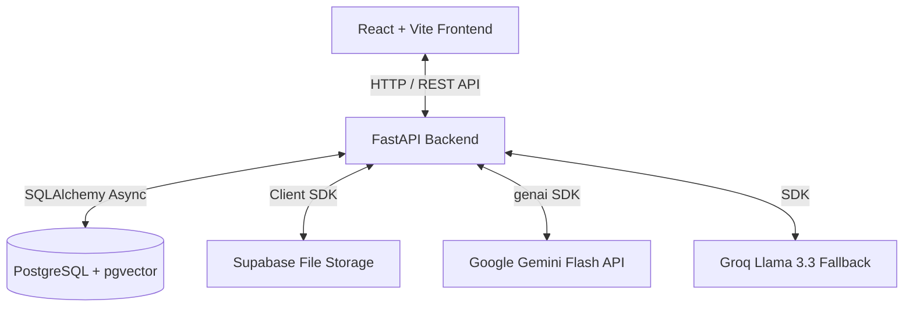
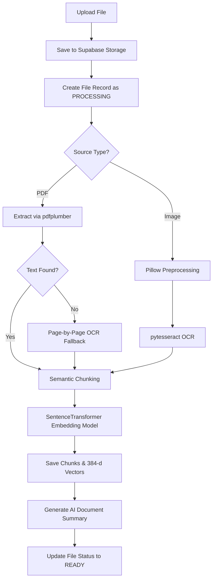

# MemoryOS - Technical Details & Architectural Overview

MemoryOS is an advanced **Personal Knowledge Engine** that enables users to upload, search, interact with, and visualize their digital knowledge base (PDF documents, screenshots, and notes) in a unified, AI-grounded workspace.

---

## 1. High-Level System Architecture

MemoryOS uses a modern, decoupled architecture:



- **Frontend**: A highly responsive Single Page Application (SPA) built with React 18, TypeScript, Vite, and Tailwind CSS.
- **Backend**: An asynchronous ASGI service built with Python 3.10+ and FastAPI, utilizing SQLAlchemy 2.0 for database operations.
- **Database**: PostgreSQL equipped with the `pgvector` extension for efficient vector similarity searches.
- **File Storage**: Private Supabase Storage buckets for hosting raw PDFs and screenshots.
- **AI Engine**: Primary pipelines run on Google Gemini Flash via the Google GenAI SDK, with automated failover routing to Groq's Llama-3.3-70B model.

---

## 2. Core Database Schema

The database consists of nine tables managed using asynchronous SQLAlchemy ORM definitions and tracked via Alembic migrations:

### `users`
Represents registered accounts, storing authentication credentials, OAuth details, custom system instructions, and theme/UI preferences.
- `id`: UUID (Primary Key)
- `email`: VARCHAR(255) (Unique, Indexed)
- `hashed_password`: VARCHAR(255) (Nullable, for local authentication)
- `oauth_provider`: ENUM ('local', 'google', 'github')
- `oauth_id`: VARCHAR(255) (Nullable)
- `custom_instructions`: TEXT (Custom prompt guidance appended to RAG queries)
- `preferences`: JSONB (Stores `default_search_top_k`, `chat_auto_title_enabled`, etc.)

### `files`
Tracks user documents (PDFs and images) uploaded to Supabase Storage.
- `id`: UUID (Primary Key)
- `user_id`: ForeignKey(`users.id`)
- `source_type`: ENUM ('pdf', 'screenshot')
- `filename`: VARCHAR(255)
- `storage_path`: VARCHAR(512) (Path inside the private bucket)
- `status`: ENUM ('uploading', 'processing', 'ready', 'failed')
- `summary`: TEXT (Cached document summary generated upon ingestion)

### `chunks`
Contains semantic sections of text extracted from files, mapped to vector embedding coordinates.
- `id`: UUID (Primary Key)
- `file_id`: ForeignKey(`files.id`)
- `content`: TEXT (Raw text snippet)
- `page_number`: INTEGER (Nullable, tracks PDF source page)
- `embedding`: VECTOR(384) (Sentence-Transformers coordinate array)

### `tags` & `file_tags`
Allows associating multiple labels/tags with documents via a many-to-many relationship.
- `tags`: `id` (UUID), `name` (VARCHAR(100), Unique)
- `file_tags`: `file_id` (ForeignKey), `tag_id` (ForeignKey)

### `conversations` & `messages`
Maintains conversational context and message histories for Q&A threads.
- `conversations`: `id` (UUID), `user_id`, `title` (VARCHAR(255)), `is_pinned` (BOOLEAN)
- `messages`: `id` (UUID), `conversation_id`, `role` (ENUM: 'user', 'assistant'), `content` (TEXT), `sources` (JSONB array listing referenced file chunks)

---

## 3. Data Ingestion & Processing Pipeline

When a document or screenshot is uploaded, it runs through the following pipeline:



### Text Extraction & Fallback Processing
- **PDF Extraction**: Backend parses text page-by-page using `pdfplumber`. If digital text is missing (e.g. scanned documents), it falls back to page-level OCR.
- **Image OCR Preprocessing**: Before OCR runs, images are enhanced using Pillow:
  1. Grayscale conversion.
  2. Deskew/orientation correction using pytesseract OSD.
  3. 2.0x contrast multiplication.
  4. Upscaling of low-resolution images.
- **OCR Engine**: Text extraction from images is handled via `pytesseract`.
- **Failure Resilience**: If extraction outputs 0 chunks, the background pipeline marks the file as `FAILED` rather than creating empty index entries, preventing downstream query errors.

### Semantic Chunking
Extracted text is split into chunks respecting page boundaries using an algorithm aligned to paragraph (`\n\n`) and sentence (`.!?`) structures:
- `CHUNK_SIZE`: 500 characters
- `CHUNK_OVERLAP`: 100 characters
- `MIN_CHUNK_SIZE`: 100 characters (smaller trailing fragments are merged into preceding chunks)
- `MAX_CHUNK_SIZE`: 800 characters

### Vector Representation
Each text chunk is converted to a **384-dimensional float vector** using the local CPU-optimized `all-MiniLM-L6-v2` SentenceTransformer model.

---

## 4. Semantic Search & RAG Flow

Conversational search utilizes a Retrieve-and-Generate (RAG) framework optimized for context accuracy:

### Step 1: Query Reformulation
When inside an active chat session, a user's prompt is sent to Google Gemini Flash along with the last 5 messages to reformulate conversational follow-ups into standalone, self-contained search queries.

### Step 2: Vector Retrieval
The standalone query is embedded (384-d) and matched against the `chunks` table using pgvector's cosine distance calculation:
```sql
SELECT *, 1 - (embedding <=> :query_emb) AS similarity 
FROM chunks 
WHERE file_id IN (user_files) AND 1 - (embedding <=> :query_emb) >= :threshold
ORDER BY similarity DESC 
LIMIT 15;
```

### Step 3: Semantic Reranking
Retrieved chunks are passed through a semantic reranker to prioritize context:
- **Primary**: Local CrossEncoder model `cross-encoder/ms-marco-MiniLM-L-6-v2` scoring chunk relevance on the CPU.
- **Alternate**: Asynchronous Gemini LLM reranker evaluating context directly.

### Step 4: Grounded Answer Synthesis
The top `top_k` reranked chunks are packaged into a generation prompt alongside:
- The user's query.
- The user's workspace/profile context (e.g. full name, preferred name, job role).
- Custom system instructions.

This prompt is sent to Google Gemini Flash. The model generates a structured markdown response including inline source citations. If the primary Gemini service fails or rate limits, the request automatically falls back to Groq's Llama 3.3 70B model.

---

## 5. Dynamic Knowledge Graph

MemoryOS generates a dynamic graph visualization representing file relationships:
1. **Centroid Calculation**: For each document, all chunk vectors are mean-pooled to generate a single 384-dimensional document centroid.
2. **Similarity Computation**: Cosine similarity is computed between all centroids.
3. **Graph Construction**: Documents represent nodes. If the similarity score between two document centroids exceeds `GRAPH_SIMILARITY_THRESHOLD` (default: 0.35), a link/edge is constructed.
4. **Rendering**: The frontend renders this graph dynamically using SVG and a D3-based force-directed layout engine, supporting zoom, drag, and node selection.

---

## 6. Authentication & Security

- **JWT Session Tokens**: Standard local authentication uses hashed passwords (`bcrypt`) and issues cryptographically signed HS256 JWT tokens.
- **Social OAuth2**: Built-in support for Google and GitHub social logins.
- **Row-Level Security**: Every backend API query filters documents, chunks, conversations, and search histories by `user_id` obtained from the active JWT token, preventing cross-tenant data leaks.
- **Autofill Security Styles**: The login form overrides system Webkit autofill CSS to guarantee password dot readability on dark backgrounds.
